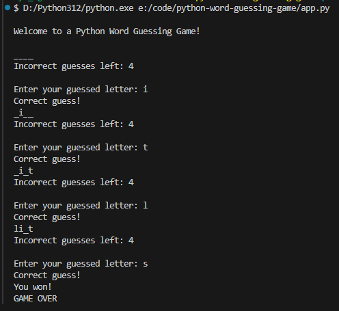

# Python Word Guessing Game 📖

Word Guessing Game written in Python 2024 💻

Following along Pearson's Skill Up With Python series from 2023. Not a direct match to the class, purposely made changes.

## Requirements 📜

- Python 3.11++

Optional:

- Bash terminal
- Visual Studio Code

## Setup 🔧

When running this codebase, it was originally coded on a Windows 11 machine with Python 3.12.4 using Visual Studio Code.

You can check your version with: `python --version`

You will want to setup a Python environment in VSC. To do this:

- Ctrl + Shift + P
- Find `Python: Create Environment...`
- Choose `.venv`
- Select interpreter (in this case Python 3.12.4)

If you have any terminals open in Visual Studio Code, you will want to relaunch them to allow the virtual environment to take effect.

## How to Run 🏃

- Open a terminal and cd to the directory that contains app.py
- Run python app.py
- Done!
